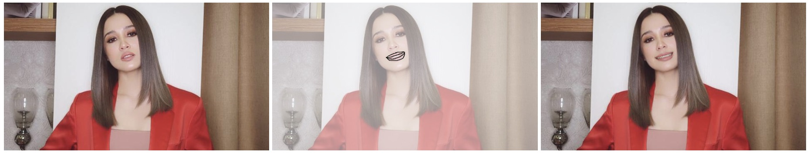

## SketchEdit: Mask-Free Local Image Manipulation with Partial Sketches

Yu Zeng1, Zhe Lin2, Vishal M. Patel1

1Johns Hopkins University, 2Adobe Research

[[Paper]](https://arxiv.org/pdf/2111.15078.pdf)&emsp; [[Code]](https://github.com/zengxianyu/sketchedit)&emsp; [[Online Demo]](#interactive-demo)&emsp; [[Supplementary Material]](https://maildluteducn-my.sharepoint.com/:b:/g/personal/zengyu_mail_dlut_edu_cn/EeKLBdVAq25GmBAEeoLWNfYBXOBMbrDZHTeT7ApndkrR-w?e=IoHtfo)

&emsp;&emsp;&emsp;&emsp;&emsp;&emsp;

## Update
- [x] :new: Uploading custom photos are now enabled in the demo 
- [x] :new: Edit face in a fullbody/upper body photo

- [ ] Enable general scenes editing in the demo (maybe use a classfier to automatically switch models for face/scenes editing?)
- [ ] Exposing predicted mask & mask revising? 

## Interactive Demo
An online interactive demo can be found at [http://47.57.135.203:8001/](http://47.57.135.203:8001/)

## Results

