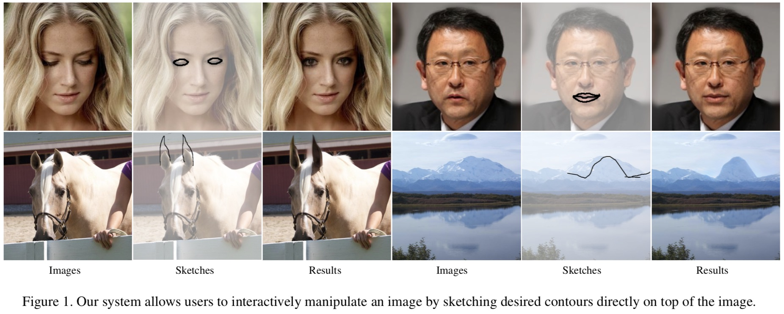
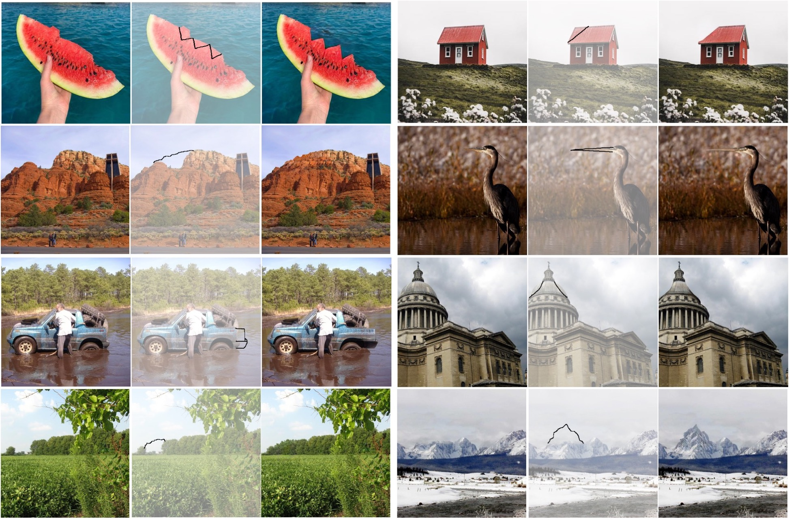

## SketchEdit: Mask-Free Local Image Manipulation with Partial Sketches

Yu Zeng1, Zhe Lin2, Vishal M. Patel1

1Johns Hopkins University, 2Adobe Research

[[Paper]]()&emsp; [[Code]](https://github.com/zengxianyu/sketchedit)&emsp; [[Online Demo]](#interactive-demo)&emsp; [[Supplementary Material]]()

&emsp;&emsp;&emsp;&emsp;&emsp;&emsp;

## Interactive Demo
An online interactive demo can be found at [http://47.57.135.203:8001/](http://47.57.135.203:8001/)

## Results

